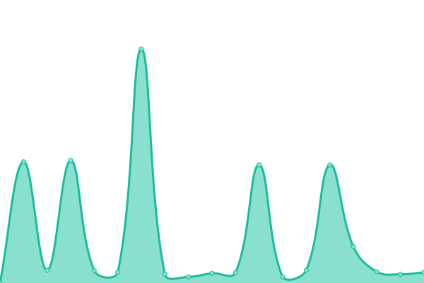
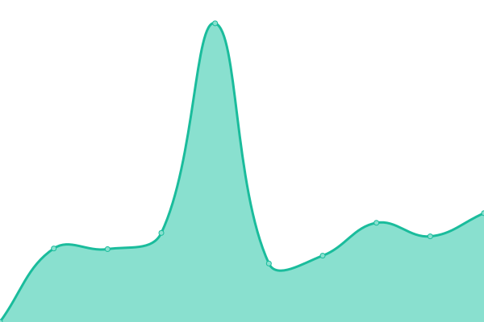

# [📈 Live Status](https://status.forgoodeyesonly.eu): <!--live status--> **🟧 Partial outage**

This repository contains the open-source uptime monitor and status page for [For Good Eyes Only](https://forgoodeyesonly.eu), powered by [Upptime](https://github.com/upptime/upptime).

With [Upptime](https://upptime.js.org), you can get your own unlimited and free uptime monitor and status page, powered entirely by a GitHub repository. We use [Issues](https://github.com/ForGoodEyesOnly/status/issues) as incident reports, [Actions](https://github.com/ForGoodEyesOnly/status/actions) as uptime monitors, and [Pages](https://status.forgoodeyesonly.eu) for the status page.

<!--start: status pages-->
<!-- This summary is generated by Upptime (https://github.com/upptime/upptime) -->
<!-- Do not edit this manually, your changes will be overwritten -->
<!-- prettier-ignore -->
| URL | Status | History | Response Time | Uptime |
| --- | ------ | ------- | ------------- | ------ |
|  [ForGoodEyesOnly.eu](https://forgoodeyesonly.eu) | 🟥 Down | [for-good-eyes-only-eu.yml](https://github.com/ForGoodEyesOnly/status/commits/HEAD/history/for-good-eyes-only-eu.yml) | 

 1499ms
     
 | 

<a href="https://status.forgoodeyesonly.eu/history/for-good-eyes-only-eu">99.48%</a>
    

|  [blog.ForGoodEyesOnly.eu](https://blog.forgoodeyesonly.eu) | 🟥 Down | [blog-for-good-eyes-only-eu.yml](https://github.com/ForGoodEyesOnly/status/commits/HEAD/history/blog-for-good-eyes-only-eu.yml) | 

 731ms
     
 | 

<a href="https://status.forgoodeyesonly.eu/history/blog-for-good-eyes-only-eu">31.94%</a>
    

|  [Pixelcode Apps on Mastodon](https://mstdn.social/@pixelcodeapps) | 🟩 Up | [pixelcode-apps-on-mastodon.yml](https://github.com/ForGoodEyesOnly/status/commits/HEAD/history/pixelcode-apps-on-mastodon.yml) | 

 788ms
     
 | 

<a href="https://status.forgoodeyesonly.eu/history/pixelcode-apps-on-mastodon">100.00%</a>
    

<!--end: status pages-->

[**Visit our status website →**](https://status.forgoodeyesonly.eu)

## 📄 License

- Powered by: [Upptime](https://github.com/upptime/upptime)
- Code: [MIT](./LICENSE) © [For Good Eyes Only](https://forgoodeyesonly.eu)
- Data in the `./history` directory: [Open Database License](https://opendatacommons.org/licenses/odbl/1-0/)
