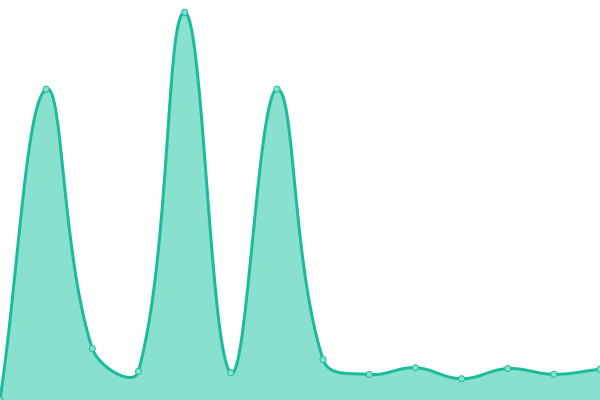
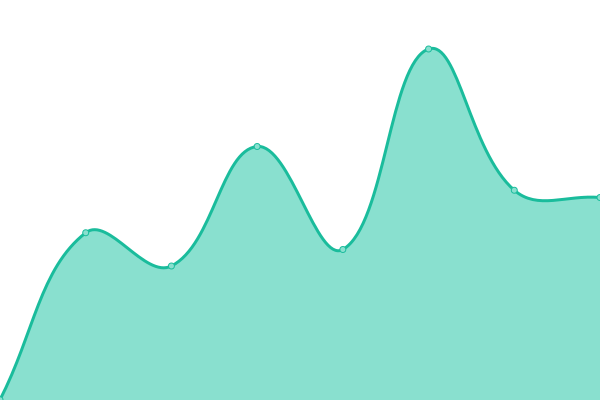

# [📈 Live Status](https://uptime.forgoodeyesonly.eu): <!--live status--> **🟧 Partial outage**

This repository contains the open-source uptime monitor and status page for [For Good Eyes Only](https://forgoodeyesonly.eu), powered by [Upptime](https://github.com/upptime/upptime).

With [Upptime](https://upptime.js.org), you can get your own unlimited and free uptime monitor and status page, powered entirely by a GitHub repository. We use [Issues](https://github.com/ForGoodEyesOnly/status/issues) as incident reports, [Actions](https://github.com/ForGoodEyesOnly/status/actions) as uptime monitors, and [Pages](https://uptime.forgoodeyesonly.eu) for the status page.

<!--start: status pages-->
<!-- This summary is generated by Upptime (https://github.com/upptime/upptime) -->
<!-- Do not edit this manually, your changes will be overwritten -->
<!-- prettier-ignore -->
| URL | Status | History | Response Time | Uptime |
| --- | ------ | ------- | ------------- | ------ |
|  [Homepage](https://forgoodeyesonly.eu) | 🟩 Up | [homepage.yml](https://github.com/ForGoodEyesOnly/status/commits/HEAD/history/homepage.yml) | 

 3024ms
     
 | 

<a href="https://uptime.forgoodeyesonly.eu/history/homepage">97.74%</a>
    

|  [Blog](https://blog.forgoodeyesonly.eu) | 🟥 Down | [blog.yml](https://github.com/ForGoodEyesOnly/status/commits/HEAD/history/blog.yml) | 

 3372ms
     
 | 

<a href="https://uptime.forgoodeyesonly.eu/history/blog">96.79%</a>
    

|  [Uptime Kuma](https://status.forgoodeyesonly.eu) | 🟥 Down | [uptime-kuma.yml](https://github.com/ForGoodEyesOnly/status/commits/HEAD/history/uptime-kuma.yml) | 

 0ms
     
 | 

<a href="https://uptime.forgoodeyesonly.eu/history/uptime-kuma">0.00%</a>
    

|  [Pixelcode Apps on Mastodon](https://mstdn.social/@pixelcodeapps) | 🟩 Up | [pixelcode-apps-on-mastodon.yml](https://github.com/ForGoodEyesOnly/status/commits/HEAD/history/pixelcode-apps-on-mastodon.yml) | 

 1092ms
     
 | 

<a href="https://uptime.forgoodeyesonly.eu/history/pixelcode-apps-on-mastodon">100.00%</a>
    

<!--end: status pages-->

[**Visit our status website →**](https://uptime.forgoodeyesonly.eu)

## 📄 License

- Powered by: [Upptime](https://github.com/upptime/upptime)
- Code: [MIT](./LICENSE) © [Anand Chowdhary](https://anandchowdhary.com), supported by [Pabio](https://pabio.com)
- Data in the `./history` directory: [Open Database License](https://opendatacommons.org/licenses/odbl/1-0/)
